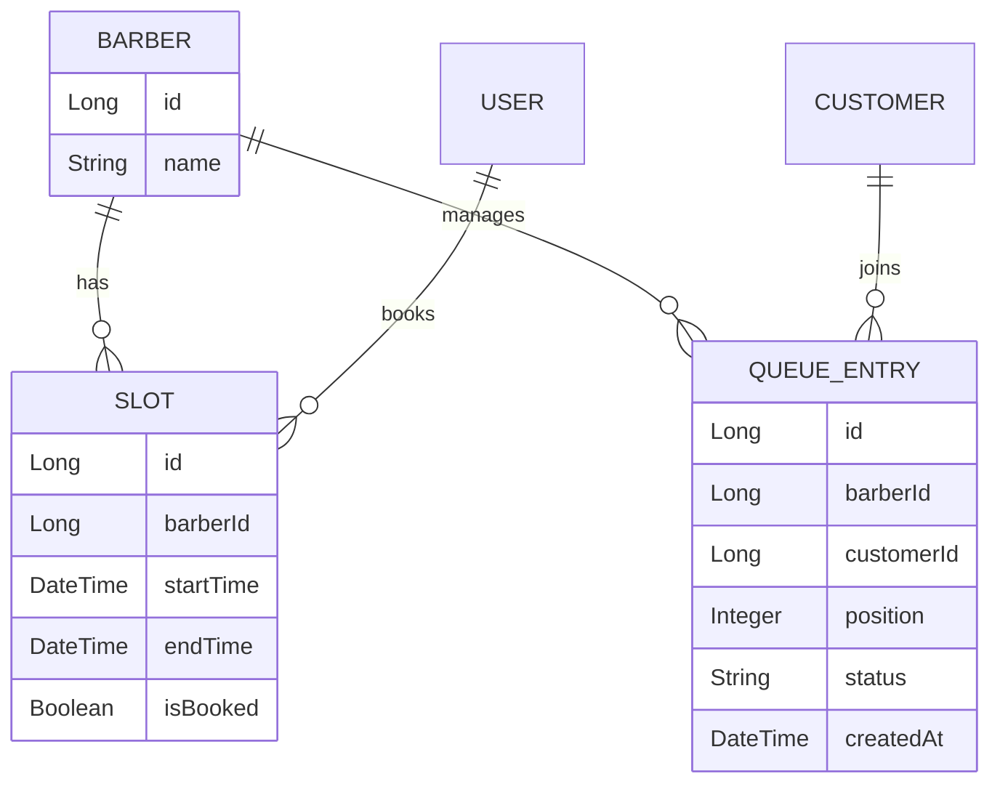

# Database Documentation 🗄️

## Overview
The application uses **Spring Data JPA** with Hibernate for ORM.
Current Database: **H2 In-Memory** (for development)

## Entity Relationship Diagram (ERD)

## Schema Details

### `queue_entries` Table
Tracks standard queue positions.
- **id**: Primary Key
- **barber_id**: Foreign Key to Barber
- **customer_id**: Foreign Key to Customer
- **position**: Current position in line (1 = next)
- **status**: `WAITING`, `IN_PROGRESS`, `COMPLETED`, `NO_SHOW`

### `slots` Table
Tracks appointment slots.
- **id**: Primary Key
- **barber_id**: Foreign Key
- **start_time**: Slot start
- **end_time**: Slot end
- **is_booked**: Booking status

## Accessing Data
Since we are using H2, you can access the database console directly in your browser.

1. Start the application
2. Go to [http://localhost:8080/h2-console](http://localhost:8080/h2-console)
3. **JDBC URL**: `jdbc:h2:mem:barbershop`
4. **User Name**: `sa`
5. **Password**: *(empty)*
